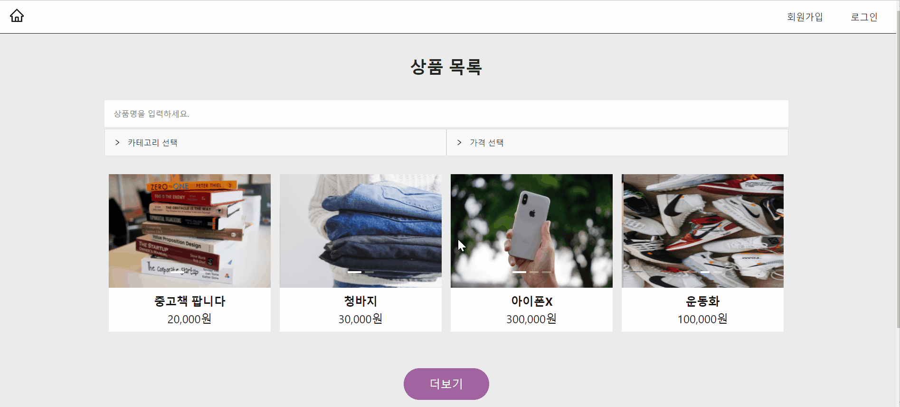
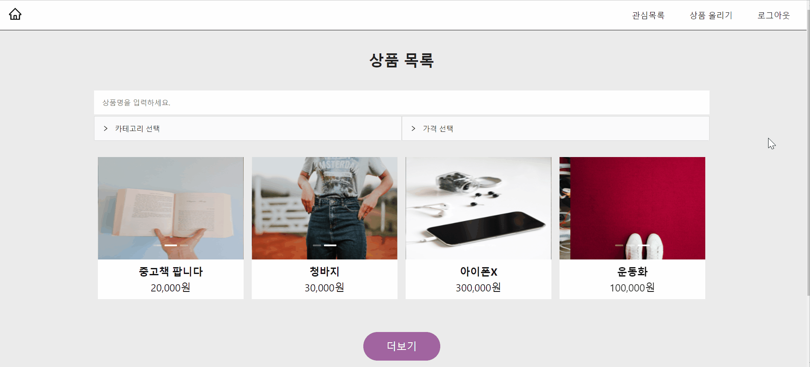

# mern 프로젝트

- mongodb, express, react, node를 통해 웹 전반적인 흐름을 공부하기 위해 mern stack 프로젝트를 시작했다.
- 이 프로젝트를 통해 서버에서 받은 데이터를 적절한 방법으로 화면에 그리는 연습을 하고, 브라우저와 네트워크에 대한 이해를 높여서 효율적으로 데이터 다루는 능력을 쌓고 싶다.
- 백엔드에 대한 지식이 많이 부족하기에 [인프런 강의](https://inf.run/untY)를 참고하며 추가로 공부하고 있다.

## 1. 이름: 중고 마켓

- 중고 물건을 사고 팔 수 있는 사이트를 목표로 진행 중이다.
- 
- 

## 2. 기능 및 특징:

- 판매하고 싶은 중고 물건 게시글을 작성하고, 카테고리/가격/키워드를 통해 원하는 상품을 찾는 기능까지 완성하였다.
- 상세 페이지에 댓글 기능과 좋아요 기능을 추가하고, 좋아요 누른 게시글을 모아볼 수 있는 페이지도 만들 계획이다.
- 사진이 많아질수록 속도가 느려지는 것 같아서 이 부분도 보완이 필요하다.

## 3. 사용한 기술 스택

- `Redux Toolkit` 라이브러리를 사용하여 상태 관리를 하였다.
- 유저 관련 state는 각 페이지마다 권한을 분리해야 하기 때문에 전역에서 관리해야 하는데, 이에 적합한 상태 관리 저장소 역할을 하는 것이 리덕스라고 생각했다. 그 중에서도 코드를 비교적 간결하게 만들어주는 리덕스 툴킷 방식을 사용하였고, 툴킷을 설치하면 기본으로 제공해주는 thunk와 devtool을 사용할 수 있어서 편리했다.
- `styled-components`를 사용하여 css in js 방식을 사용하였고, 반응형으로 스타일링하였다.
- `ant design` 프레임워크도 사용하였는데, antd의 그리드시스템을 사용할 때 가로스크롤이 생기는 문제가 있어서 많은 시간이 소비됐다.
- 서버단 프로그래밍은 처음이라서, 인터넷 강의를 참고하여 진행하였다.
- `mongodb`에 데이터베이스를 생성하고, `mongoose`를 사용하였다. 몽구스는 자바스크립트 객체와 몽고디비 문서를 1대1 매칭해주는 역할을 한다고 한다. 따라서 데이터베이스에서 어떠한 데이터를 조회할 때 자바스크립트 객체로 바꿔준다.
- 이미지 파일 업로드 기능은 `drop-zone`을 사용하고, `multer`를 사용하여 그 파일을 로컬 폴더에 저장하였다.

## 4. 구현 방식

### 4.1 리덕스 툴킷

- redux toolkit은 redux-thunk를 기반으로 사용하며, 기본으로 redux-dev-tool을 제공하기 때문에 더이상 설치해야 할 라이브러리가 없다는 장점이 있다.
- CRA로 프로젝트를 생성할 때 처음부터 리덕스로 시작할 수 있다.
- `npx create-react-app --template redux`
- 동일하게 store를 생성하는데, `configureStore`를 사용한다.

```javascript
import { configureStore } from '@reduxjs/toolkit';
import userReducer from '../redux/user/userSlice';

export const store = configureStore({
  reducer: {
    user: userReducer,
  },
});
```

- `createAsyncThunk`로 비동기 액션을 만들 수 있다.

```javascript
// userAPI.js
export const registerUser = createAsyncThunk('user/registerUser', async (dataToSubmit) => {
  const request = await axios
    .post('api/users/register', dataToSubmit)
    .then((response) => response.data);
  return request;
});
```

- `extraReducers`를 사용하면 비동기 액션에 대해 `pending`, `fulfilled`, `rejected` 상태로 구분할 수 있다.

```javascript
// userSlice.js
const userSlice = createSlice({
  name: 'user',
  initialState: {
    userData: '',
  },
  reducers: {},
  extraReducers: {
    [registerUser.pending]: (state) => {
      state.status = 'loading';
    },
    [registerUser.fulfilled]: (state, { payload }) => {
      state.register = payload;
      state.status = 'success';
    },
    ...

export const selectUser = (state) => state.user.userData;
export default userSlice.reducer;
```

- `state`를 내보내기 하면 컴포넌트에서 간단하게 접근할 수 있게 된다

```javascript
// NavBar.js
import { selectUser } from '../../redux/user/userSlice';
const userData = useSelector(selectUser);
```

### 4.2 이미지 미리보기 및 업로드

- 
- 글을 작성할 때 이미지를 첨부할 수 있는데, `Dropzone` 공식 문서에 나와있는 코드를 참고하여 아래의 코드로 틀을 만들었다.

```javascript
<Dropzone onDrop={dropHandler}>
  {({ getRootProps, getInputProps }) => (
    <div {...getRootProps()} className="files">
      <input {...getInputProps()} />
      <div>
        <CameraOutlined />
        <p>{images.length}개의 사진</p>
      </div>
    </div>
  )}
</Dropzone>
```

- `onDrop`에 아래와 같은 이벤트 핸들러 함수를 넣었다.
- 이미지 첨부와 동시에 backend에 전달이 되도록 `axios.post`하고, 응답 받은 데이터를 state에 담아서 업데이트 하였다.
- 이렇게 파일 업로드를 할 때는 `formData`를 사용하여 `key-value` 형식으로 서버에 전송할 수 있다는 것을 알게 되었다.
- 이때 `multipart/form-data` 타입을 같이 명시해줘야 한다.

```javascript
  const dropHandler = useCallback(
    (files) => {
      let formData = new FormData();
      const config = {
        header: { 'content-type': 'multipart/form-data' },
      };
      formData.append('file', files[0]);

      axios.post('api/product/image', formData, config).then((response) => {
        if (response.data.success) {
          setImages([...images, response.data.filePath]);
          console.log(response.data);
        } else {
          alert('Error');
        }
      });
    },
    [images, updateImages],
```

- 그런 다음 백엔드에서는 `multer`로 로컬 loads 폴더에 이미지를 저장할 수 있다는 것을 알게 되었다.
- 마찬가지로 공식문서에서 가이드를 참고하였으며, 실제 배포를 할 때는 aws s3와 연동하는 방법이 필요할 것 같다.

```javascript
var storage = multer.diskStorage({
  destination: function (req, file, cb) {
    cb(null, 'uploads/');
  },
  filename: function (req, file, cb) {
    cb(null, `${Date.now()}_${file.originalname}`);
  },
});

// 받아온 파일을 저장
var upload = multer({ storage: storage }).single('file');
```

- 이제 요청받은 이미지 정보를 응답하는 코드를 작성해야 하는데, img 태그에 src 경로가 필요하기 때문에 filePath

```javascript
// 저장한 정보를 프론트에 전달
router.post('/image', (req, res) => {
  upload(req, res, (err) => {
    if (err) {
      return res.json({ success: false, err });
    }
    return res.json({
      success: true,
      filePath: res.req.file.path,
    });
  });
});
```

- 그러면 프론트는 받은 응답을 통해 화면에 사진 미리보기를 구현할 수 있게 된다.
- `styled-components`를 사용했기 때문에 태그명이 `Img`로 되어 있다.
- 받아온 데이터를 `images` state 배열에 담아놓고, map 메서드를 돌려서 화면에 그려낸다.

```javascript

  {images.map((img, index) => (
    <div key={index} onClick={() => deleteHandler(img)}>
      
    </div>
  ))}
</Img>
```

- 이때, 사진을 클릭하면 해당 사진을 삭제할 수도 있다.
- 클릭한 요소의 인덱스를 `indexOf`로 알아낸 다음, `splice`로 제거하여 업데이트한다.

```javascript
const deleteHandler = useCallback(
  (img) => {
    const currentIndex = images.indexOf(img);
    const newArr = [...images];
    newArr.splice(currentIndex, 1);
    setImages(newArr);
  },
  [images, updateImages],
);
```

### 4.3 체크박스, 라디오박스 필터링

- 
- 메인페이지에 바로 상품 목록들이 보여지는데, 이 부분이 가장 중요하다.
- 기본적으로 데이터베이스에 있는 목록들을 일정량 가져오고, 더보기 버튼 클릭 시에 추가로 가져오고, 유저가 선택한 목록만 가져오기도 하기 때문이다.

```javascript
// product collection에 들어있는 모든 상품 정보 가져오기
router.post('/products', (req, res) => {
  Product.find()
    .populate('writer')
    .exec((err, productInfo) => {
      if (err) return res.status(400).json({ success: false, err });
      res.status(200).json({ success: true, productInfo });
    });
});
```

- 우선, 데이터베이스에 있는 모든 정보를 가져오려면 위 방식으로 데이터를 보내주면 된다.
- 마찬가지로 이 데이터를 state에 담아서 map으로 하나씩 화면에 구현하면 되는데, 여기서 각종 변수를 추가해야 한다.

### 4.4 가격 콤마 넣기

- 상품을 클릭했을 때 상세 정보 페이지에 담기는 컴포넌트인데, 받아온 가격 데이터에 콤마를 붙여야 했다.
- 검색을 통해 정규표현식 코드를 알게 되어서 다음과 같이 적용하였다.
- 서버에서 데이터를 받았을 때 setState가 적용되도록 하였다.

```javascript
const ProductInfo = (props) => {
  const price = props.detail.price;
  const [commaPrice, setCommaPrice] = useState(0);

  useEffect(() => {
    if (price) {
      setCommaPrice(price.toString().replace(/\B(?=(\d{3})+(?!\d))/g, ','));
    }
  }, [price]);

  return (
    <Info>
      <h2>{props.detail.title}</h2>
      <strong>{commaPrice}원</strong>
      <p>{props.detail.description}</p>
    </Info>
  );
};
```

## 5. 기타

- front-back 간 데이터 주고 받는 연습을 하면서 http에 대해 더 공부해야겠다고 생각했다.
- 단순히 이론에 대한 지식만 습득하면 금방 지치는 성격이라서 이렇게 프로젝트를 실행하면서 그때 그때 사용되는 지식을 찾고 공부하는 것이 재밌게 느껴진다.
